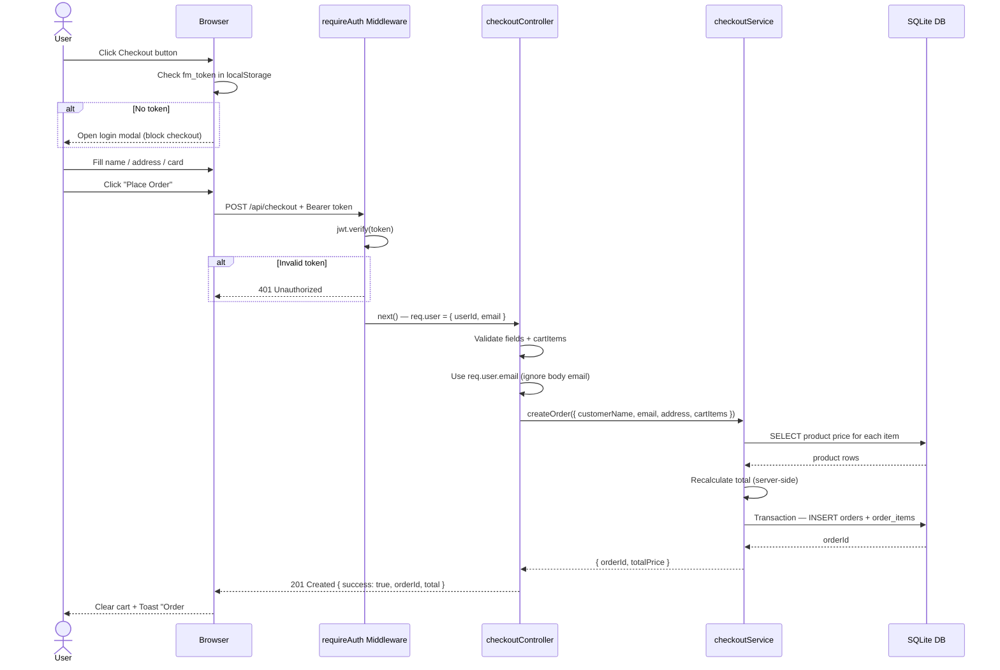

# Sequence Diagram — Checkout & Order History

## Flow: POST /api/checkout

```
User        Browser (Frontend)       requireAuth Middleware     checkoutController      checkoutService        SQLite DB
 |                  |                        |                         |                      |                    |
 |--click---------->|                        |                         |                      |                    |
 |  "Checkout"      |                        |                         |                      |                    |
 |                  |                        |                         |                      |                    |
 |                  |--check localStorage-   |                         |                      |                    |
 |                  |  fm_token exists?      |                         |                      |                    |
 |                  |                        |                         |                      |                    |
 |<--if no token----|                        |                         |                      |                    |
 |  show authModal  |                        |                         |                      |                    |
 |  (block checkout)|                        |                         |                      |                    |
 |                  |                        |                         |                      |                    |
 |--fill form------->|                        |                         |                      |                    |
 |  name, address,  |                        |                         |                      |                    |
 |  card number     |                        |                         |                      |                    |
 |                  |                        |                         |                      |                    |
 |--submit---------->|                        |                         |                      |                    |
 |                  |                        |                         |                      |                    |
 |                  |--POST /api/checkout--->|                         |                      |                    |
 |                  |  Authorization:        |                         |                      |                    |
 |                  |  Bearer <token>        |                         |                      |                    |
 |                  |  { name, address,      |                         |                      |                    |
 |                  |    card, cartItems }   |                         |                      |                    |
 |                  |                        |                         |                      |                    |
 |                  |                        |--jwt.verify(token)--    |                      |                    |
 |                  |                        |                         |                      |                    |
 |                  |                        |--if invalid: 401------->|                      |                    |
 |                  |                        |                         |                      |                    |
 |                  |                        |--if valid: next()------>|                      |                    |
 |                  |                        |  req.user = { userId,   |                      |                    |
 |                  |                        |    email }              |                      |                    |
 |                  |                        |                         |                      |                    |
 |                  |                        |                         |--validate fields-     |                    |
 |                  |                        |                         |  name, address, card  |                    |
 |                  |                        |                         |  cartItems not empty  |                    |
 |                  |                        |                         |                      |                    |
 |                  |                        |                         |--use req.user.email-  |                    |
 |                  |                        |                         |  (not body email)     |                    |
 |                  |                        |                         |                      |                    |
 |                  |                        |                         |--createOrder()------->|                    |
 |                  |                        |                         |                      |                    |
 |                  |                        |                         |                      |--lookup each------>|
 |                  |                        |                         |                      |  product by ID     |
 |                  |                        |                         |                      |                    |
 |                  |                        |                         |                      |<--product row------|
 |                  |                        |                         |                      |                    |
 |                  |                        |                         |                      |--recalculate total  |
 |                  |                        |                         |                      |  (server price)    |
 |                  |                        |                         |                      |                    |
 |                  |                        |                         |                      |--transaction()---->|
 |                  |                        |                         |                      |  INSERT orders     |
 |                  |                        |                         |                      |  INSERT order_items|
 |                  |                        |                         |                      |                    |
 |                  |                        |                         |                      |<--orderId----------|
 |                  |                        |                         |                      |                    |
 |                  |                        |                         |<--{ orderId, total }--|                    |
 |                  |                        |                         |                      |                    |
 |                  |<--201 Created----------|                         |                      |                    |
 |                  |  { success: true,      |                         |                      |                    |
 |                  |    orderId, total }    |                         |                      |                    |
 |                  |                        |                         |                      |                    |
 |                  |--clear cart----------  |                         |                      |                    |
 |                  |  show toast            |                         |                      |                    |
 |                  |  "Order #X confirmed!" |                         |                      |                    |
 |                  |                        |                         |                      |                    |
 |<--feedback--------|                        |                         |                      |                    |
```

---

## Flow: GET /api/orders

```
User        Browser (Frontend)       requireAuth Middleware     orderController         orderService           SQLite DB
 |                  |                        |                         |                      |                    |
 |--click---------->|                        |                         |                      |                    |
 |  "My Orders"     |                        |                         |                      |                    |
 |                  |                        |                         |                      |                    |
 |                  |--GET /api/orders------>|                         |                      |                    |
 |                  |  Authorization:        |                         |                      |                    |
 |                  |  Bearer <token>        |                         |                      |                    |
 |                  |                        |                         |                      |                    |
 |                  |                        |--jwt.verify(token)--    |                      |                    |
 |                  |                        |--req.user.email-------->|                      |                    |
 |                  |                        |                         |                      |                    |
 |                  |                        |                         |--getOrdersByEmail()-->|                    |
 |                  |                        |                         |                      |                    |
 |                  |                        |                         |                      |--SELECT orders---->|
 |                  |                        |                         |                      |  WHERE email = ?   |
 |                  |                        |                         |                      |                    |
 |                  |                        |                         |                      |<--orders array-----|
 |                  |                        |                         |                      |                    |
 |                  |                        |                         |                      |--SELECT items----->|
 |                  |                        |                         |                      |  per order         |
 |                  |                        |                         |                      |                    |
 |                  |                        |                         |<--orders + items-----|                    |
 |                  |                        |                         |                      |                    |
 |                  |<--200 OK + JSON--------|                         |                      |                    |
 |                  |  { success: true,      |                         |                      |                    |
 |                  |    count: N, data: [] }|                         |                      |                    |
 |                  |                        |                         |                      |                    |
 |<--render orders---|                        |                         |                      |                    |
```

---

## Mermaid Diagram — Checkout


