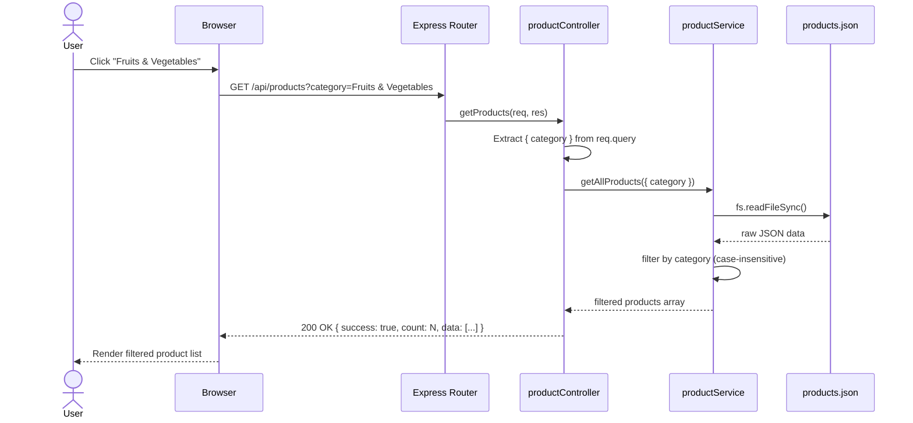

# Sequence Diagram — Product Filter (GET /api/products?category=...)

## Flow Description

When a user clicks a category (e.g. "Fruits & Vegetables") on the frontend, the following sequence occurs:

```
User          Browser (Frontend)         Express Server          productController       productService        products.json
 |                   |                         |                        |                      |                    |
 |--click category-->|                         |                        |                      |                    |
 |                   |                         |                        |                      |                    |
 |                   |--GET /api/products?---->|                        |                      |                    |
 |                   |  category=Fruits &      |                        |                      |                    |
 |                   |  Vegetables             |                        |                      |                    |
 |                   |  Accept: application/   |                        |                      |                    |
 |                   |  json                   |                        |                      |                    |
 |                   |                         |                        |                      |                    |
 |                   |                         |--route match---------->|                      |                    |
 |                   |                         |  GET /                 |                      |                    |
 |                   |                         |                        |                      |                    |
 |                   |                         |                        |--extract query-----  |                    |
 |                   |                         |                        |  { category,         |                    |
 |                   |                         |                        |    minPrice,         |                    |
 |                   |                         |                        |    maxPrice, sort }  |                    |
 |                   |                         |                        |                      |                    |
 |                   |                         |                        |--getAllProducts()---->|                    |
 |                   |                         |                        |  { category: "Fruits |                    |
 |                   |                         |                        |    & Vegetables" }   |                    |
 |                   |                         |                        |                      |                    |
 |                   |                         |                        |                      |--readFile()------->|
 |                   |                         |                        |                      |                    |
 |                   |                         |                        |                      |<--raw JSON---------|
 |                   |                         |                        |                      |                    |
 |                   |                         |                        |                      |--filter by------   |
 |                   |                         |                        |                      |  category          |
 |                   |                         |                        |                      |  (case-insensitive)|
 |                   |                         |                        |                      |                    |
 |                   |                         |                        |<--filtered array-----|                    |
 |                   |                         |                        |                      |                    |
 |                   |                         |                        |--wrap response-----  |                    |
 |                   |                         |                        |  { success: true,    |                    |
 |                   |                         |                        |    count: N,         |                    |
 |                   |                         |                        |    data: [...] }     |                    |
 |                   |                         |                        |                      |                    |
 |                   |                         |<--200 OK + JSON--------|                      |                    |
 |                   |                         |  Content-Type:         |                      |                    |
 |                   |                         |  application/json      |                      |                    |
 |                   |                         |                        |                      |                    |
 |                   |--render products-----   |                        |                      |                    |
 |                   |  (filtered list)        |                        |                      |                    |
 |                   |                         |                        |                      |                    |
 |<--display UI------|                         |                        |                      |                    |
```

---

## Error Scenarios

| Scenario                        | Server Response                                      |
|---------------------------------|------------------------------------------------------|
| Server crashes / file unreadable| `500 Internal Server Error` `{ success: false, message: "Failed to retrieve products." }` |
| Product ID not found            | `404 Not Found` `{ success: false, message: "Product not found." }` |
| No products match the filter    | `200 OK` `{ success: true, count: 0, data: [] }`     |

---

## Mermaid Diagram (for tools that support it)


