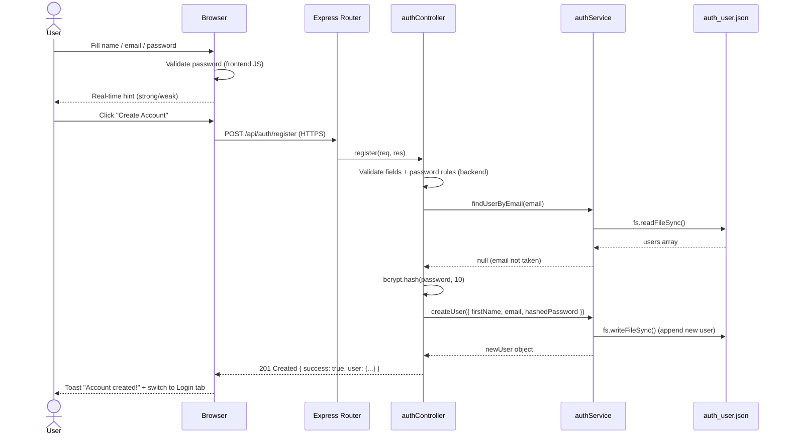

# Sequence Diagram — User Registration

## Flow: POST /api/auth/register

```
User          Browser (Frontend)        Express Server         authController        authService          auth_user.json
 |                   |                        |                      |                     |                     |
 |--fill form------->|                        |                      |                     |                     |
 |  name, email,     |                        |                      |                     |                     |
 |  password         |                        |                      |                     |                     |
 |                   |                        |                      |                     |                     |
 |                   |--validate password--   |                      |                     |                     |
 |                   |  (frontend JS)         |                      |                     |                     |
 |                   |  • 8+ chars?           |                      |                     |                     |
 |                   |  • 1 uppercase?        |                      |                     |                     |
 |                   |  • 1 special char?     |                      |                     |                     |
 |                   |                        |                      |                     |                     |
 |<--show hint-----  |                        |                      |                     |                     |
 |  (real-time)      |                        |                      |                     |                     |
 |                   |                        |                      |                     |                     |
 |--click submit---->|                        |                      |                     |                     |
 |                   |                        |                      |                     |                     |
 |                   |--POST /api/auth/------>|                      |                     |                     |
 |                   |  register              |                      |                     |                     |
 |                   |  Content-Type:         |                      |                     |                     |
 |                   |  application/json      |                      |                     |                     |
 |                   |  { firstName, email,   |                      |                     |                     |
 |                   |    password }          |                      |                     |                     |
 |                   |  (over HTTPS)          |                      |                     |                     |
 |                   |                        |                      |                     |                     |
 |                   |                        |--route match-------->|                     |                     |
 |                   |                        |  POST /register      |                     |                     |
 |                   |                        |                      |                     |                     |
 |                   |                        |                      |--validate fields-   |                     |
 |                   |                        |                      |  (backend check)    |                     |
 |                   |                        |                      |  • required fields? |                     |
 |                   |                        |                      |  • password rules?  |                     |
 |                   |                        |                      |                     |                     |
 |                   |                        |                      |--findUserByEmail()->|                     |
 |                   |                        |                      |  (check duplicate)  |                     |
 |                   |                        |                      |                     |--readFile()-------->|
 |                   |                        |                      |                     |                     |
 |                   |                        |                      |                     |<--users array-------|
 |                   |                        |                      |                     |                     |
 |                   |                        |                      |                     |--find by email--    |
 |                   |                        |                      |                     |                     |
 |                   |                        |                      |<--null (not found)--|                     |
 |                   |                        |                      |                     |                     |
 |                   |                        |                      |--bcrypt.hash()--    |                     |
 |                   |                        |                      |  (hash password,    |                     |
 |                   |                        |                      |   saltRounds=10)    |                     |
 |                   |                        |                      |                     |                     |
 |                   |                        |                      |--createUser()------>|                     |
 |                   |                        |                      |  { firstName,       |                     |
 |                   |                        |                      |    email,           |                     |
 |                   |                        |                      |    hashedPassword } |                     |
 |                   |                        |                      |                     |--writeFile()------->|
 |                   |                        |                      |                     |  (append new user)  |
 |                   |                        |                      |                     |                     |
 |                   |                        |                      |<--newUser-----------|                     |
 |                   |                        |                      |                     |                     |
 |                   |                        |<--201 Created--------|                     |                     |
 |                   |                        |  { success: true,    |                     |                     |
 |                   |                        |    message, user }   |                     |                     |
 |                   |                        |                      |                     |                     |
 |                   |--show toast &          |                      |                     |                     |
 |                   |  switch to Login tab   |                      |                     |                     |
 |                   |                        |                      |                     |                     |
 |<--"Account        |                        |                      |                     |                     |
 |   created!"-------|                        |                      |                     |                     |
```

---

## Error Path: Duplicate Email

```
authController --findUserByEmail()--> authService --> auth_user.json
                                                           |
                                              <-- user found (not null)
                                                           |
authController <-- existing user exists
      |
      |--> return 409 Conflict
           { success: false, message: "Email already registered." }
```

---

## Mermaid Diagram


